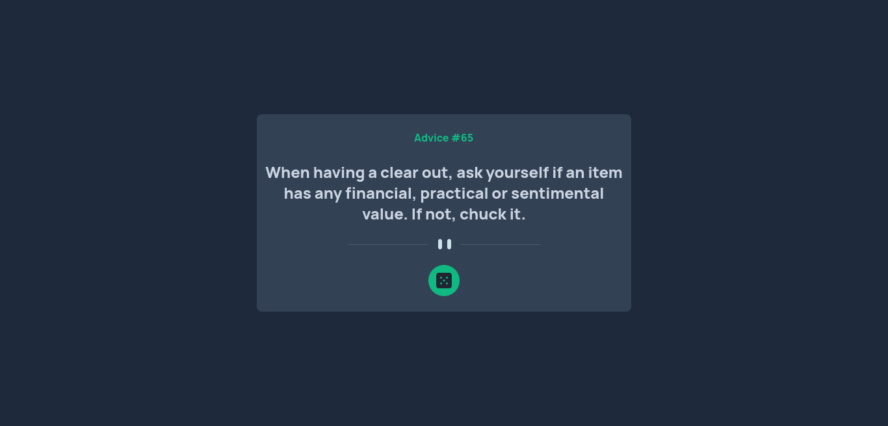

# Frontend Mentor - Advice generator app solution

This is a solution to the [Advice generator app challenge on Frontend Mentor](https://www.frontendmentor.io/challenges/advice-generator-app-QdUG-13db). Frontend Mentor challenges help you improve your coding skills by building realistic projects.

## Table of contents

- [Overview](#overview)
  - [The challenge](#the-challenge)
  - [Screenshot](#screenshot)
  - [Links](#links)
- [My process](#my-process)
  - [Built with](#built-with)
  - [What I learned](#what-i-learned)
- [Author](#author)

**Note: Delete this note and update the table of contents based on what sections you keep.**

## Overview

### The challenge

Users should be able to:

- View the optimal layout for the app depending on their device's screen size
- See hover states for all interactive elements on the page
- Generate a new piece of advice by clicking the dice icon

### Screenshot



### Links

- Solution URL: [Add solution URL here](https://www.frontendmentor.io/solutions/advice-app-using-vuejs-axios-tailwind-and-composition-api-SkBiEj4Nq)
- Live Site URL: [Add live site URL here](https://advice-app-opal.vercel.app/)

## My process

### Built with

- Semantic HTML5 markup
- Flexbox
- Mobile-first workflow
- [Vue.js](https://vuejs.org/) - JS framework
- [Vite](https://vitejs.dev/) - Frontend tooling
- [Tailwind](https://tailwindcss.com/) - CSS framework
- [Animate.css](https://animate.style/) - CSS animations
- [Axios](https://axios-http.com/ptbr/) - HTTP Client

### What I learned

I learn how to use async/await and axios to get data from API inside of the vue composition api setup

```js
setup() {
    const advice = reactive({ advice: "Wait for your advice", id: "" });

    const loadAdvice = async () => {
      let response = await axios.get("https://api.adviceslip.com/advice");

      advice.advice = response.data.slip.advice;
      advice.id = response.data.slip.id;

      console.log(response.data.slip.advice);
    }; //fetch advice from api

    loadAdvice(); //generate the default advice

    return { advice, loadAdvice };
  },
```

## Author

- Website - [Ramon A. Pereira](https://github.com/RamonAPereira)
- Frontend Mentor - [@ramonapereira](https://www.frontendmentor.io/profile/RamonAPereira)
- Twitter - [@ramonnzd](https://www.twitter.com/ramonnzd)
